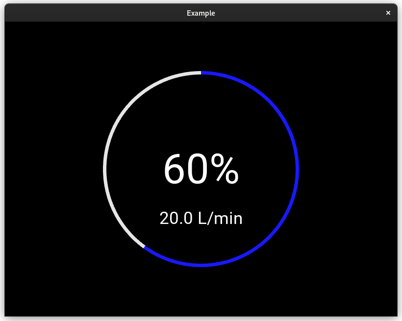
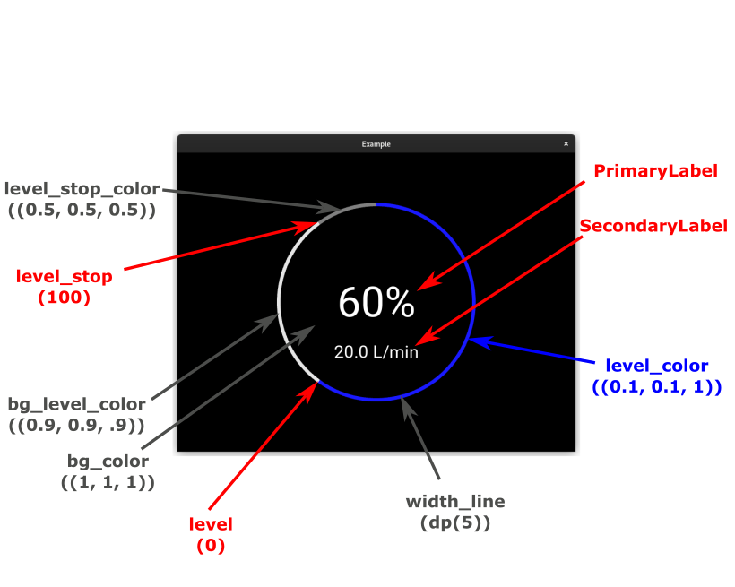
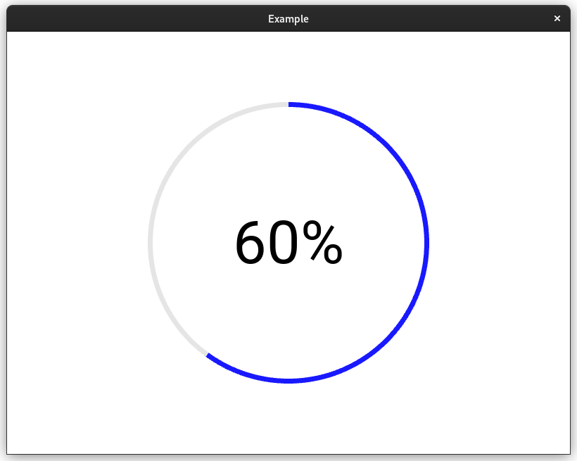
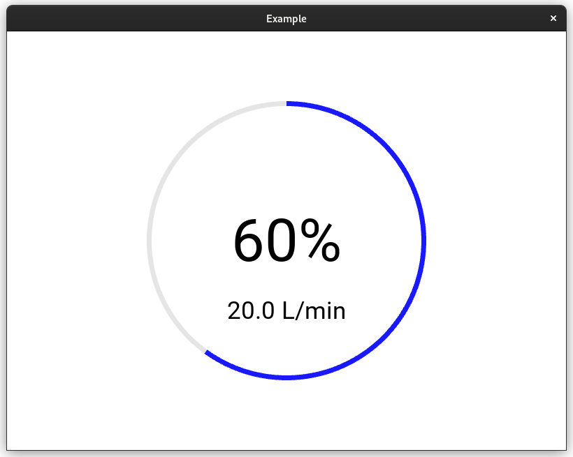

Display level in circular graphic

### Example:
```python
from kivy.lang import Builder
from kivy.app import App

KV = '''
#:import LevelCircle levelcircle.levelcircle.LevelCircle
#:import PrimaryLabel levelcircle.levelcircle.PrimaryLabel
#:import SecondaryLabel levelcircle.levelcircle.SecondaryLabel

BoxLayout:
    size_hint: None, None
    size: dp(400), dp(400)
    pos_hint: {'center_x': 0.5,'center_y': 0.5}
    LevelCircle:
        level: 60
        bg_color: 0, 0, 0
        width_line: dp(7)
        PrimaryLabel:
            text: "60%"
        SecondaryLabel:
            text: "20.0 L/min"
'''


class Example(App):
    def build(self):
        self.load_kv("levelcircle/levelcircle.kv")
        return Builder.load_string(KV)


Example().run()
```
Output:




## Description


### PrimaryLabel
```python
​LevelCircle:
	level: 60
	​PrimaryLabel:
		text: "60%"
		color: "black"
```
Output:


### SecondaryLabel
```python
​LevelCircle:
	level: 60
	​PrimaryLabel:
		text: "60%"
		color: "black"
	​SecondaryLabel:
		text: "20.0 L/min"
		color: "black"
```
Output:



#### Complete code example:
```python
from kivy.lang import Builder
from kivy.app import App

KV = '''
#:import LevelCircle levelcircle.levelcircle.LevelCircle
#:import PrimaryLabel levelcircle.levelcircle.PrimaryLabel
#:import SecondaryLabel levelcircle.levelcircle.SecondaryLabel

FloatLayout:
    canvas:
        Color:
            rgb: 1,1,1
        Rectangle:
            pos: self.pos
            size: self.size
    BoxLayout:
        size_hint: None, None
        size: dp(400), dp(400)
        pos_hint: {'center_x': 0.5,'center_y': 0.5}
        LevelCircle:
            level: 60
            width_line: dp(7)
            PrimaryLabel:
                text: "60%"
		        color: "black"

'''


class Example(App):
    def build(self):
        self.load_kv("levelcircle/levelcircle.kv")
        return Builder.load_string(KV)


Example().run()
```

### Properties
`level`:
Level in graphic. Value between 0 and 100

`level_stop`:
Allowed level. The not allowed level will be marked dark. Value between 0 and 100.

`level_color`:
Color of level marked. Default: `(0.1, 0.1, 1)`

`level_stop_color`:
Color of not allowed level. Default: `(0.5, 0.5, 0.5)`

`bg_level_color`: 
Color of level line. Default: `(0.9, 0.9, .9)`

`bg_color`:
Backgroud color. Default: `(1, 1, 1)`

`width_line`:
Width of llevel line. Default: `dp(5)`
